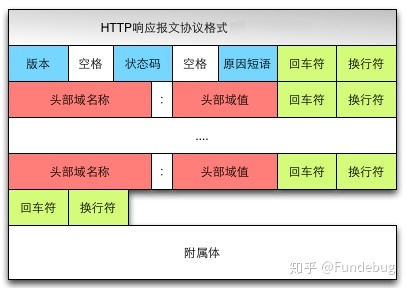

## 从输入 URL 到展现页面的全过程

* 总体来说分为以下几个过程
  * 输入URL
  * DNS解析URL，将域名解析成IP地址
  * TCP连接，三次握手
  * 发送HTTP请求
  * 服务器端处理HTTP请求并返回HTTP响应报文
  * 浏览器解析HTTP响应报文，渲染页面内容
  * TCP断开连接，四次挥手

* 输入URL
  * URL被称为统一资源定位符

* 域名解析

    输入的网址需要被解析成IP地址，才能进行确确实实地被得到访问。所谓的域名解析，其实就是通过域名  
    查找IP地址，或者逆向通过IP地址反向查找域名的服务。一般的话，DNS记录会被缓存在浏览器，电脑操作  
    系统这里，除此之外DNS服务器还存在于互联网提供商和根服务器这里。
    * DNS查询的顺序一般是先从本地缓存的记录中去查询，第一步：浏览器缓存；第二部：电脑操作系统缓存
    * 如果本地计算机没有记录的话，就会到路由器的DNS缓存去查询
    * 如果路由器缓存也没有的话，就会到互联网服务提供商去查询
    * 如果互联网服务提供商也没有查询到的话，就会向根服务器发出请求查询

* TCP三次握手
  TCP三次握手建立连接，之前学习到过

* 发送HTTP请求
  TCP三次握手结束后，开始发送HTTP请求报文。请求报文由请求行、请求头和请求体三个部分组成:

  

  * 请求行包含了请求方法、URL、协议版本三个信息
    * 请求方法包括了：GET,POST,PUT,DELETE,HEAD,PATCH,OPTIONS,TRACE等等
    * URL就是访问的网址信息
    * 协议版本一般会是HTTP/1.1,当然这个需要根据实际情况去看，也会有1.0版本的使用

  * 请求头包含了请求的附加信息，必须请求报文数据内容的类型，比如JSON；比如是否使用keepalive，也  
    就是持久连接，一个连接就可以发送多个请求了，而不是每次发送完请求之后就断开了

* 服务器处理请求并返回HTTP报文
   服务器接收到请求报文之后，会进行相应的处理，处理过后，一般会有相应的处理结果返回回来。被称之为  
   响应报文，响应报文由响应行、响应头和响应体三部分组成:

    

    之后可以根据响应的状态码来判断请求的处理结果

* 浏览器解析渲染页面  
  大致可以分为以下五个步骤:
  * 根据HTML解析出DOM树
  * 根据CSS解析生成CSS规则树
  * 结合DOM树和CSS规则树，生成渲染树
  * 根据渲染树计算每一个节点的信息
  * 根据计算好的信息绘制页面

* TCP断开连接
  TCP四次挥手断开连接，之前学习到过
