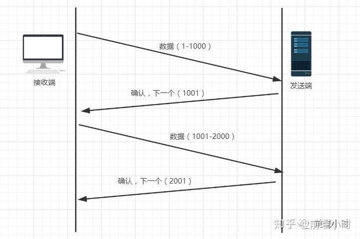
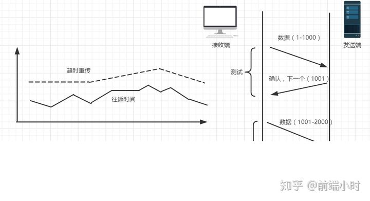

# TCP 怎么保证可靠传输？

## TCP主要通过了检验和、序列号/确认应答、超时重传、最大消息长度、滑动窗口控制等方法实现了可靠性传输。

* 检验和
  * TCP校验和（Checksum）是一个端到端的校验和，由发送端计算，然后由接收端验证。其目的是为了发现TCP首部和数据在发送端到接  
    收端之间发生的任何改动。如果接收方检测到校验和有差错，则TCP段会被直接丢弃。
* 序列号/确认应答
  * 这个机制类似于问答的形式。比如在课堂上老师会问你“明白了吗？”，假如你没有隔一段时间没有回应或者你说不明白，那么老师就会  
    重新讲一遍。其实计算机的确认应答机制也是一样的，发送端发送信息给接收端，接收端会回应一个包，这个包就是应答包。  
    

   上述过程中，只要发送端有一个包传输，接收端没有回应确认包（ACK包），都会重发。或者接收端的应答包，发送端没有收到也会重发  
   数据。这就可以保证数据的完整性。

* 超时重传
  超时重传是指发送出去的数据包到接收到确认包之间的时间，如果超过了这个时间会被认为是丢包了，需要重传。那么我们该如何确认这个  
  时间值呢？
  我们知道，一来一回的时间总是差不多的，都会有一个类似于平均值的概念。比如发送一个包到接收端收到这个包一共是0.5s，然后接收端  
  回发一个确认包给发送端也要0.5s，这样的两个时间就是RTT（往返时间）。然后可能由于网络原因的问题，时间会有偏差，称为抖动（方差）。
  从上面的介绍来看，超时重传的时间大概是比往返时间+抖动值还要稍大的时间。
  
  但是在重发的过程中，假如一个包经过多次的重发也没有收到对端的确认包，那么就会认为接收端异常，强制关闭连接。并且通知应用通信异常  
  强行终止。

* 最大消息长度
  在建立TCP连接的时候，双方会约定好一个最大的长度（MSS）作为发送的单位，重传的时候也是以这个单位来进行重传。理想的情况下是该长度  
  的数据刚好不被网络层分块。

* 滑动窗口控制
    TCP滑动窗口分为接受窗口和发送窗口。滑动窗口是传输层进行流量控制的一种措施，接收方通过通告发送方自己的窗口大小，从而控制发送方  
    的发送速度，从而达到防止发送方发送速度过快而导致自己被淹没的目的。

    

    滑动窗口主要有两个作用，一个是提供TCP的可靠性；另一个是提供TCP的流量控制特性。TCP段中，window字段是16bit位的。它代表的是  
    窗口的字节容量，也就是TCP的标准窗口最大为2^16-1=65535个字节。

    

  * 发送窗口只有收到对端服务器，对于本段发送窗口内字节的ACK确认的时候，才会移动发送窗口的左边界
    * 接收窗口只有在前面所有的段都确认的情况下，才会移动左边界。当在前面还有字节未接收但收到后面字节的情况下，窗口不会移动，并不会  
    对后续字节确认。以此确保对端会对这些数据重传。

