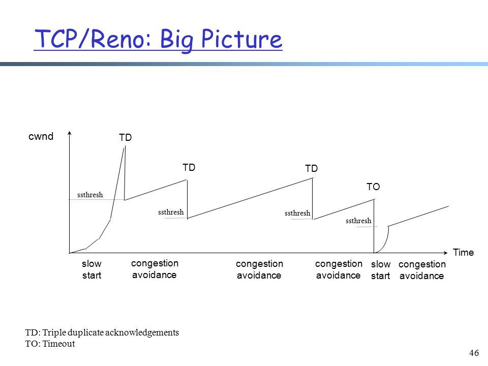

## TCP 中常见的拥塞控制算法有哪些？

### 常见的拥塞控制算法包括：1.linux内核默认的Reno算法和Google的BBR算法

* 拥塞控制的概念  
    我们把网络链路上可以容纳的数据包数量，比喻成一根水管。我们希望这根水管可以尽可能地多  
    传输水，那我们就往水管里面注水就好了，但是我们又必须得考虑到水流量过大导致水管破裂的  
    情况，所以对比与网络环境来说，这个就是拥塞控制。在网络环境中，为了防止链路不会发生类似  
    于水管破裂的情况发生，TCP维护了一个拥塞窗口cwnd(congestion windows)，通过该窗口  
    来估计在一段时间内网络链路上面可以承受的最大数据包数量。拥塞窗口的大小取决于网络的拥塞  
    程度，并且动态地发生变化。（水管发生破裂，相对应网络中的现象就是丢包）

* 常见的拥塞控制算法
  * Linux内核默认的Reno算法
  * Google的BBR算法

* Reno算法
  * 该算法将拥塞控制的过程分为了四个阶段：慢启动、拥塞避免、快重传和快恢复
  

  * 慢启动阶段的思路是不要一开始就发送大量的数据，先探测一下网络的拥塞程度，也就是说由小到大  
    逐渐增加拥塞窗口的大小，在没有出现丢包的时候，每收到一个ACK就将拥塞窗口大小加一（拥塞窗口  
    的单位是MSS，最大单个报文段长度），每次发送都将窗口增加一倍，呈指数增长；若出现丢包的情况  
    ，则将拥塞窗口减半，进入拥塞避免阶段。
  * 当窗口达到慢启动阈值或出现丢包的时候，就进入拥塞避免状态，窗口每轮次大小加一，呈线性增长；当收到  
    对一个报文的三个重复的ACK的时候，就认为这个报文的下一个报文丢失了，进入到快重传阶段，要求  
    接收方在收到一个失去顺序的报文段之后，就立即发出重复确认(为的是使发送方及早知道有报文段没有  
    到达对方，可提高网络吞吐量约20%)而不要等到自己发送数据的时候捎带确认
  * 快重传阶段完成之后进入快恢复阶段，将慢启动阈值修改为当前拥塞窗口  
    值的一半，同时拥塞窗口值等于慢启动阈值，然后进入拥塞避免阶段，重复上述过程。

* Reno算法的四个步骤，更清晰的讲解
  * 慢启动算法 – Slow Start
    所谓慢启动，也就是TCP连接刚建立，一点一点地提速，试探一下网络的承受能力，以免直接扰乱了网络通道的秩序：
    1. 连接建好的开始先初始化拥塞窗口cwnd大小为1，表明可以传一个MSS大小的数据。
    2. 每当收到一个ACK，cwnd大小加一，呈线性上升。
    3. 每当过了一个往返延迟时间RTT(Round-Trip Time)，cwnd大小直接翻倍，乘以2，呈指数让升。
    4. 还有一个ssthresh（slow start threshold），是一个上限，当cwnd >= ssthresh时，就会进入“拥塞避免算法”（后面会说这个算法）
  * 拥塞避免算法 – Congestion Avoidance
    如同前边说的，当拥塞窗口大小cwnd大于等于慢启动阈值ssthresh后，就进入拥塞避免算法。算法如下：
    1. 收到一个ACK，则cwnd = cwnd + 1 / cwnd
    2. 每当过了一个往返延迟时间RTT，cwnd大小加一。  
    过了慢启动阈值后，拥塞避免算法可以避免窗口增长过快导致窗口拥塞，而是缓慢的增加调整到网络的最佳值。  
  * 拥塞状态时的算法
    TCP拥塞控制默认认为网络丢包是由于网络拥塞导致的，所以一般的TCP拥塞控制算法以丢包为网络进入拥塞状态的信号。  
    对于丢包有两种判定方式，一种是超时重传RTO(Retransmission Timeout)超时，另一个是收到三个重复确认ACK。

    * 超时重传RTO(Retransmission Timeout)超时，TCP会重传数据包。TCP认为这种情况比较糟糕，反应也比较强烈：
      1. 由于发生丢包，将慢启动阈值ssthresh设置为当前cwnd的一半，即ssthresh = cwnd / 2.
      2. cwnd重置为1
      3. 进入慢启动过程
    * 当收到三个重复确认ACK时，TCP开启快速重传Fast Retransmit算法，而不用等到RTO超时再进行重传：
      1. cwnd大小缩小为当前的一半
      2. ssthresh设置为缩小后的cwnd大小
      3. 然后进入快速恢复算法Fast Recovery。

  * 快速恢复算法 – Fast Recovery
    在进入快速恢复之前，cwnd和ssthresh已经被更改为原有cwnd的一半。快速恢复算法的逻辑如下：

    1. cwnd = cwnd + 3 MSS，加3 MSS的原因是因为收到3个重复的ACK。
    2. 重传DACKs指定的数据包。
    3. 如果再收到DACKs，那么cwnd大小增加一。
    4. 如果收到新的ACK，表明重传的包成功了，那么退出快速恢复算法。将cwnd设置为ssthresh，然后进入拥塞避免算法。

