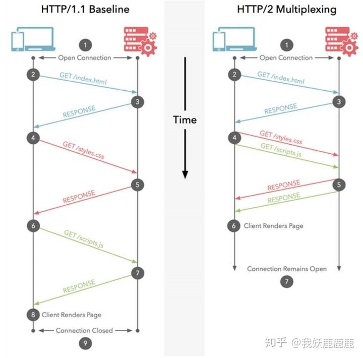
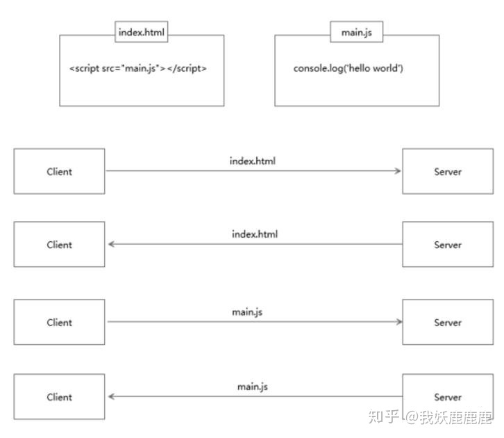
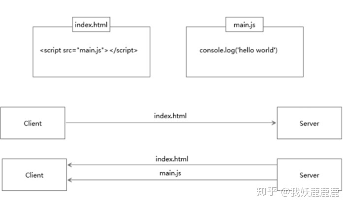

## 简述 HTTP 1.0，1.1，2.0 的主要区别

* HTTP1.0和1.1之间的区别
  * 缓存策略  
    http1.0的缓存策略主要是依赖header中的If-Modiified-Since,Expire(到期)；  
    http1.1的缓存策略要比http1.0略多,例如 Entity tag(实体标签), If-Unmodified-Since, If-Match, If-None-Match等.

  * 宽带和网络连接优化
    http1.0中会存在一些性能浪费,比如我们的只需要对象中的一部分,但是每次请求返回的却是整个对象,这无疑造成了性能的损害
    http1.1则不然,它可以通过在请求头处设置range头域,就可以返回请求资源的某一部分,也就是返回码为206(Partial Content)的时候,这对于性能优化很有必要.

  * 长连接
    http1.1支持长连接和请求的流水线(pipelining),在一个TCP链接上可以传送多个http请求和响应.这样就不用多次建立和关闭TCP连接了.  
    HTTP1.1增加Connection字段，通过设置Keep-Alive保持HTTP连接不断卡。避免每次客户端与服务器请求都要重复建立释放建立TCP连接。提高了网络的利用率。

* HTTP2.0和HTTP1.x之间的区别
  * 解析协议类型
    http1.0的解析是基于文本协议的各式解析；而http2.0的协议解析是二进制格式，更加强大

  * 多路复用
    一个连接上可以有多个request,且可以随机的混在一起,每个不同的request都有对应的id,服务端可以通过request_id来辨别,大大加快了传输速率

    

  * 头部压缩
    http1.x中的header需要携带大量信息.而且每次都要重复发送；http2.0使用encode来减少传输的header大小.而且客户端和服务端可以各  
    自缓存(cache)一份header filed表,避免了header的重复传输,还可以减少传输的大小.
  * 服务端推送
    可以通过解析html中的依赖,智能地返回所需的其他文件(css或者js渲染文件等),而不用再发起一次请求.

    

    

