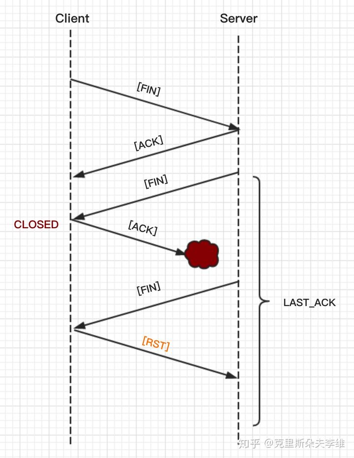
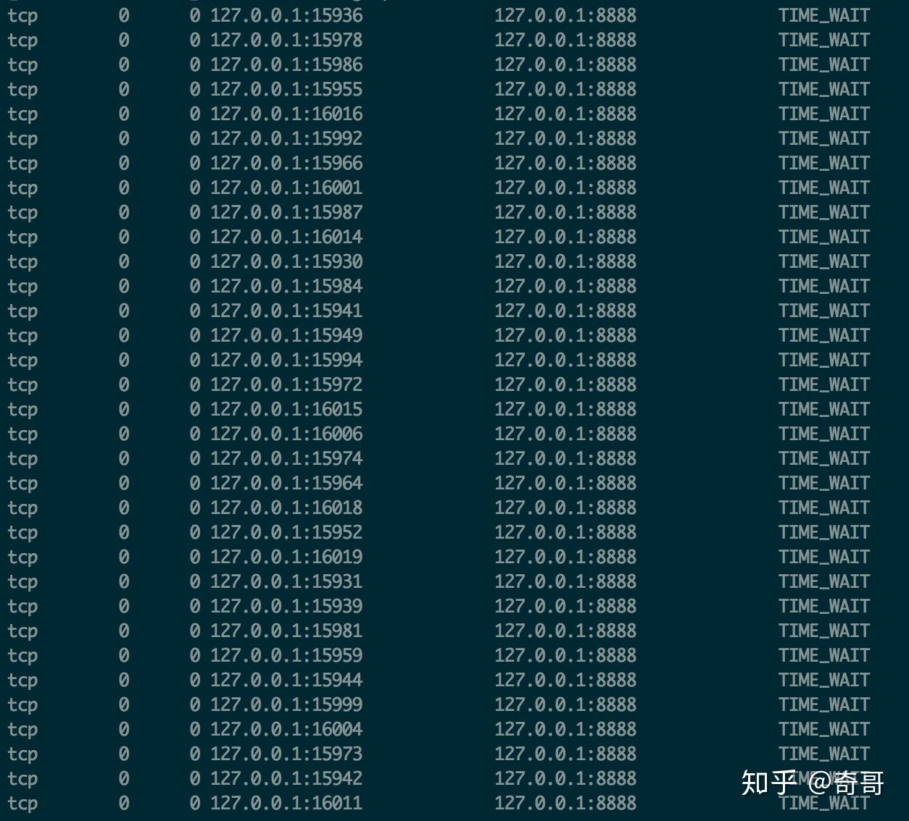

## 简述 TCP 的 TIME_WAIT

* 主动关闭方在收到被动关闭方的FIN包后，并返回ACK后，会进入TIME_WAIT状态，TIME_WAIT状态又被称作2MSL  
状态，每个TCP连接都必须有一个最大报文段生存时间MSL。在网络传输中超过这个时间的报文段将被丢弃。当TCP连接发起  
一个主动关闭，并发出最后一个ACK时，必须在TIME_WAIT状态停留两倍MSL时间，在2MSL等待期间，定义这个连接的端口  
将不能再被使用。2MSL状态的存在有两个理由：
  * 1.允许老的重复报文分组在网络中消逝
  * 2.保证TCP全双工连接的正确关闭

* 为什么是2MSL而不是MSL
  * 一个MSL是确保主动关闭方最后的ACK能够到达对端。
  * 一个MSL是确保被动关闭方重发的FIN能够被主动关闭方收到。

如果主动方最终发送给被动方的ACK丢失的话，那么服务器（被动方）就会重新发送那个FIN，以允许主动关闭方重新发送那  
个ACK。要是主动关闭方不维护2MSL状态，那么主动关闭将会不得不响应一个RST报文段，而服务器将会把它解释为一个错误，  
导致TCP连接没有办法完成全双工的关闭，而进入半关闭状态。  
    

### 延伸出来的问题：如果TIME_WAIT过多的话，会引起什么问题
  * 当在高并发环境下，连接过多的话，在TCP挥手阶段，可能会引起TIME_WAIT状态的连接过多的问题:
    
    短时间后，所有的 TIME_WAIT 全都消失，被回收，端口包括服务，均正常。即，在高并发的场景下，TIME_WAIT 连接存在，属于正常现象。
  * 如果大量的TIME_WAIT状态的TCP连接存在的话，有什么业务上的影响吗？
    * 每一个TIME_WAIT状态，都会占用一个本地端口，上限为65535个（16bit, 2Byte）。当大量的连接处于TIME_WAIT状态时，  
      新建立TCP连接会出错：Address already in use: connect 异常
  * 大量的TIME_WAIT状态TCP连接存在，其本质原因是什么？
    * 大量的短连接存在
    * 对于HTTP请求来说，如果connection头部设置的值为close的时候，基本都由服务端发起主动关闭连接。
    * 而TCP四次挥手关闭连接机制中，为了保证 ACK 重发和丢弃延迟数据，设置time_wait 为2倍的 MSL（报文最大存活时间），导致  
        时间过长。
  * 解决办法
    * 客户端：HTTP请求的头部，connection设置为keep-alive，保持存活一段时间（长连接）。
    * 服务端：
      * 允许TIME_WAIT状态的socket可以被重用
      * 缩减TIME_WAIT的时间，不一定非得是2MSL

## 结论(好好复习)
* TIME_WAIT状态的影响:
  * TCP连接中，主动发起关闭连接的一端，会进入TIME_WAIT状态。
  * TIME_WAIT状态，默认会持续2MSL（报文的最大生存时间），一般是2*2mins
  * TIME_WAIT状态下，TCP连接占用的端口，无法被再次使用
  * TCP端口数量，上显示65535（16bit, 2Byte）
  * 大量的TIME_WAIT状态存在，会导致新建TCP连接出错，address already in use:connect异常
* 现实场景:
  * 服务器端，一般设置：不允许（主动关闭连接）
  * 但HTTP请求中，HTTP头部connection参数，可能设置为close。如果这样的话，服务器端处理完毕请求  
    之后，就会主动关闭TCP连接。
  * 现在浏览器中，HTTP请求connection参数，一般都设置为keep-alive
* 解决办法:
  * 服务器端允许TIME_WAIT状态的socket可以被重用；缩减TIME_WAIT的时间。
  * 客户端浏览器设置connection请求头为keep-alive
