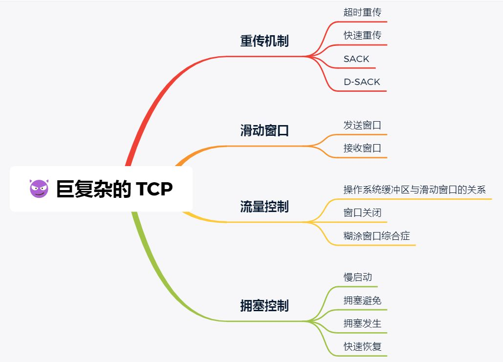
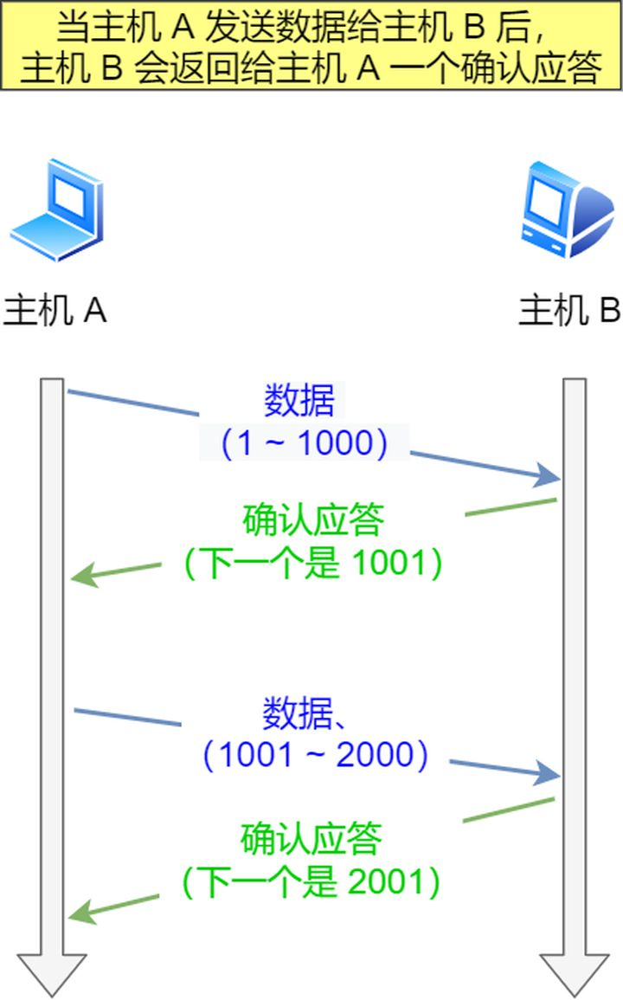

## 简述 TCP 滑动窗口以及重传机制

* 重传机制
  * 在TCP中，为了实现可靠性传输，其方法之一是通过序列号与确认应答。在TCP中，当发送端的数据到达接收主机时，接收端主机  
    会返回一个确认应答消息，表示已经收到消息。
    

    所以当网络中出现一些问题，导致某个数据包没有顺利到达接收端的话，TCP就会重新发送那个丢失的数据包，被称作TCP的重传机制，  
    TCP重传机制包括这些：
    * 超时重传
    * 快速重传
    * SACK
    * D-SACK

  * 分别学习
    * 超时重传:
      重传机制的其中一个方式，就是在发送数据的时候，设定一个定时器，当超过指定的时间后，没有收到对方的ACK确认应答报文，就会  
      重新发送该数据包。TCP会在以下两种情况下发生超时重传：
      * 数据包丢失
      * 确认应答丢失
      

    * 快速重传:
        该重传机制与超时重传机制的不同点在于，该重传方法不以时间为驱动，而是以数据来驱动重传。
      

        流程分析：seq1请求报文，携带着序列号为50的请求发送给接收方。接收方收到该请求报文之后，会返回给发送端一个确认序号为  
        51的响应报文，以表示已经收到了发送端的请求。发送端紧接着发送seq2的请求报文，携带着序列号为51的请求报文发送给接收方，  
        此时出现网络问题，接收方没有收到该请求。此时发送端没有停下脚步，紧接着又发送seq3的请求报文，携带着序列号为101的请求报文  
        给接收端，由于接收端没有收到之前序列号为51的请求报文，所以对于seq3的请求报文，最终的响应报文序列号还是51。如果发送方在  
        超时时间内发现接收到的响应报文，连续三次的确认序列号都是一样的话，就会触发重发机制，重新发送  
        请求报文给接收端。这里面需要注意的是，发送的请求报文不一定是seq2，还有可能是seq3,seq4，所以就有了接下来的SACK方法。

    * SACK方法
      * 该机制会在TCP请求头部添加一个SACK属性，它可以将缓存的地图发送给发送方。这样发送方就可以知道哪些数据收到了，哪些数据没有  
        收到，知道该信息之后，就解决了快速重传中的问题，就可以只重传丢失的数据了。
        

    * Duplicate SACK
      * 通过该机制，可以知道接收方，重复收到了哪些请求报文，该机制比较适用于，没收到接收端发送给发送端的响应报文。设想一下，  
        如果发送端发送给接收端的请求报文都被收到了的话，那么接收端没有错误的情况下，就会响应指定确认序号的响应报文回去给发送端，  
        如果发送端没有收到这个响应的话，那么就会进行重传，这时候接收端再次接收到同样请求序号的请求报文。在D-SACK机制下面，就会在  
        响应报文体中，添加一个SACK属性，里面表示了已经收到的请求序列号报文。这时候直到发送端收到这个响应报文之后，就会发现之前已经  
        被发送的请求报文原来已经被接收到了，这时可以继续发送下面的请求报文了。
        
      * 总结来说D-SACK有这些个好处：
        * 可以让「发送方」知道，是发出去的包丢了，还是接收方回应的 ACK 包丢了
        * 可以知道是不是「发送方」的数据包被网络延迟了
        * 可以知道网络中是不是把「发送方」的数据包给复制了

* 滑动窗口
    * 在没有滑动窗口之前，TCP一般是在发送端每发送完一个数据之后，都要等到接收端的确认响应报文发送回来才会接着发送下一个数据包。这样  
        就会导致效率低下。而滑动窗口的出现，就是为了解决通信效率的问题。保证了即使在往返时间较长的情况下，也不会降低网络通信的效率。  
        因为只要在窗口规定的大小范围内，那么TCP就无需等待应答，而可以直接发送接下来的报文信息。
    * 再谈实现原理
      * 滑动窗口的实现其实就是操作系统开辟的一个缓存空间，发送方主机在等待确认应答消息返回之前，必须在缓冲区保留已经发送出去的数据。  
        如果按期收到确认应答，此时就可以从缓冲区清楚。
      

       如上图所示，假设窗口大小为 3 个 TCP 段，那么发送方就可以「连续发送」 3 个 TCP 段，并且中途若有 ACK 丢失，可以通过「下一个  
       确认应答进行确认」.
       图中的 ACK 600 确认应答报文丢失，也没关系，因为可以通过下一个确认应答进行确认，只要发送方收到了 ACK 700 确认应答，就意味着  
       700 之前的所有数据「接收方」都收到了。这个模式就叫累计确认或者累计应答。

    * 在TCP的请求头的数据结构中，有一个字段是Window，就规定了滑动窗口的大小。这个字段大小一般是由接收端来定义的，接收端通过该字段信息  
      来告诉发送端，自己还有多少缓冲区可以接收数据。于是发送端就会根据这个接收端的处理能力来发送数据，而不会导致接收端处理不过来。

       

        1 是已发送并收到 ACK确认的数据：1~31 字节
        2 是已发送但未收到 ACK确认的数据：32~45 字节
        3 是未发送但总大小在接收方处理范围内（接收方还有空间）：46~51字节
        4 是未发送但总大小超过接收方处理范围（接收方没有空间）：52字节以后

        在下图，当发送方把数据「全部」都一下发送出去后，可用窗口的大小就为 0 了，表明可用窗口耗尽，在没收到 ACK 确认之前是无法继续发送数据了。

        

        在下图，当收到之前发送的数据 32~36 字节的 ACK 确认应答后，如果发送窗口的大小没有变化，则滑动窗口往右边移动 5 个字节，因为有  
         5 个字节的数据被应答确认，接下来 52~56 字节又变成了可用窗口，那么后续也就可以发送 52~56 这 5 个字节的数据了。

        
