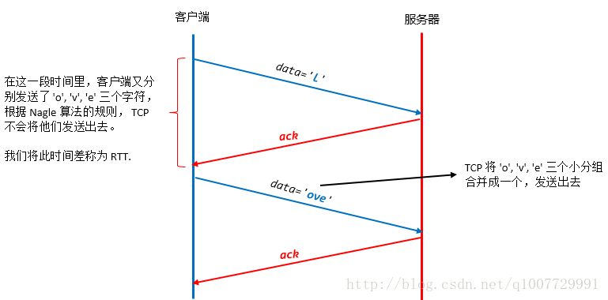

## 什么是 TCP 粘包和拆包？

* 粘包
  * 造成粘包的情况:
    * 1.由TCP连接复用造成的粘包问题
      * 如果多个进程复用一个TCP连接的话，此时多种不同结构的数据进到TCP的流式传输，边界分割肯定会出现问题。如果  
        利用TCP每次发送数据，就与对方建立连接，然后双方发送完一段数据后，就关闭连接，这样就不会出现粘包问题。
    * 2.因为TCP默认使用Nagle算法，此算法会导致粘包问题
      * Nagle算法主要做两件事，1）一个 TCP 连接上最多只能有一个未被确认的未完成的小分组，在它到达目的地前，不  
        能发送其它分组。；2）在上一个小分组未到达目的地前，即还未收到它的 ack 前，TCP 会收集后来的小分组。当上  
        一个小分组的 ack 收到后，TCP 就将收集的小分组合并成一个大分组发送出去。

    * 3.数据包过大造成的粘包问题
      * 比如应用进程缓冲区的一条消息的字节的大小超过了发送缓冲区的大小，就有可能产生粘包问题。因为消息已经被分割了，  
        有可能一部分已经被发送出去了，对方已经接受了，但是另外一部分可能刚放入套接口发送缓冲区里准备进一步发送，就  
        直接导致接受的后一部分，直接导致了粘包问题的出现。
    * 4.流量控制，拥塞控制也可能导致粘包
    * 5.接收方不及时接收缓冲区的包，造成多个包接收

* 题外话（简单了解一下Nagle这个算法是干啥的）
    * 在广域网中，一般网络延时都比较大，小分组发送出去后，可能要等很久才会收到 ack，因此，在收到 ack 前，发送方可能  
       会累积好多好多未发送的小分组。  
    在图中，客户端首先发送了一个字符 l 给服务器，在收到服务器的回应前，客户端又发送了三个分组，根据 Nagle 算法规则，  
    在未收到 ack 前，这些小分组都不能发出去。收到 ack 后，tcp 将这三个小分组合并成一个，一次性发出去。  
    

* 粘包问题怎么处理
  * 根据场景关闭掉Nagle算法
  * 尾部标记序列号。通过特殊标识符来表示数据包的边界，例如/n/r
  * 在数据包的头部加上数据长度
  * 应用层发送数据的时候定长发送数据

* 拆包
  * 假设接收方的窗口只剩下128个字节，意味着发送方最多还可以发送128个字节，而由于发送方的数据大小是256字节，因此只发送了  
    前128字节，等待接收方ACK后，才能发送剩余字节，这就造成了拆包。

* 额外的概念： MSS 和 MTU
  * MSS
    * MSS表示了TCP报文中data部分的最大长度（针对于传输层来说的）
  * MTU
    * MTU表示了链路层中，对一次可以发送的最大数据的限制（针对于数据链路层来说的）

    公式: MSS = MTU长度 - IP header - TCP header (可以这么去想，链路层在传输层的下面，传输层下面是网络层，传输层  
    加的内容是TCP头，网络层加的是IP头，所以一步一步封装就可以反着推导出来这个公式了  )