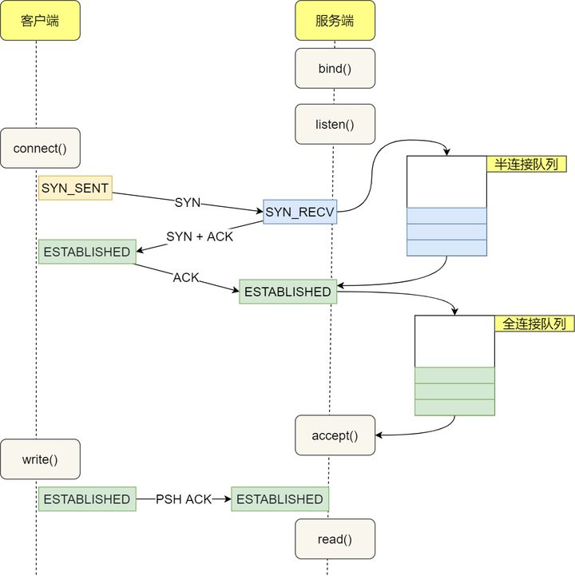

## 简述TCP半连接发生场景

* 在TCP三次握手的时候，Linux内核会维护两个队列，分别是:
  * 半连接队列，也称SYN队列
  * 全连接队列，也称accept队列

* 服务端收到客户端发起的SYN请求之后，内核会把该连接存储到半连接队列中，并向客户端响应SYN+ACK，接着
  客户端会返回ACK，服务端收到第三次握手的ACK后，内核会把连接从半连接队列移除，然后创建新的完全连接，  
  并将其添加到accept队列，等待进程调用accept函数的时候，把连接从全连接队列中取出来一个使用。
    

* 不管是半连接队列还是全连接队列，都有最大长度的限制。超过限制之后，内核会直接丢弃，或者返回RST复位报文，  
  告诉客户端连接已经建立失败。

* 服务端并发处理大量请求时，如果 TCP 全连接队列过小，就容易溢出。发生 TCP 全连接队溢出的时候，后续的请求  
  就会被丢弃，这样就会出现服务端请求数量上不去的现象。
  
