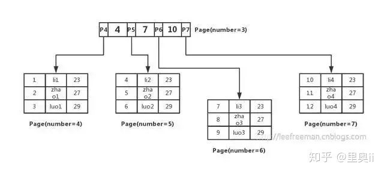

## MySQL 为什么使用 B+ 树来作索引，对比 B 树它的优点和缺点是什么？

* 题外话
  * 了解到磁盘的最小存储单位是扇区，一个扇区可以保存512字节的内容；文件系统的最小存储系统是块，一个块可以保存  
    4kb的内容；InnoDB存储引擎的最小存储单位是页（page），一个页可以存储16kb的内容。InnoDB的所有数据文件（  
    后缀为ibd的文件）大小始终是16384的整数倍  
    

    不过需要了解的是，MySQL中InnoDB数据页的大小，也可以进行自行设置。

* 对于这个问题的简单回答（不建议在面试的时候说，面试官肯定想听更详细的东西，但是大致道理是这样的）
  * 因为在B树的数据结构中，非叶子节点除了会保存指针之外，还会保存数据内容。也就是说B树的叶子节点和非叶子节点都会保存数据内容。  
    而B+树的非叶子节点只会保存指针，叶子节点只保存数据内容,这样一来B树中所能保存的指针数量就会减少（因为一些非叶子节点的空间  
    被用来保存数据了）。所以在指针少的情况下如果要保存大量数据，只能增加树的高度，导致IO操作变多，查询性能变低。  
  

* 再来复习一遍B树和B+树的区别
  * 无论是B树还是B+树，都属于查找树的一种，查询操作的时间复杂度为O(logN)。
  * B树
    * 一棵m阶的B树满足以下特性
      * 每个节点至多有m棵子树
      * 除根节点外，其他每个分支节点至少有m/2个子树
      * 根节点至少有两棵子树
      * 所有的叶子节点都出现在同一层中，叶子节点不包含任何关键字信息

  * B+树
    * 一棵m阶的B+树满足一下特性
      * 有k个子树的中间节点包含有k个元素（B树中是k-1个元素），每个元素不保存数据，只用来索引，所有数据都保存在叶子节点。
      * 所有的叶子结点中包含了全部元素的信息，及指向含这些元素记录的指针，且叶子结点本身依关键字的大小自小而大顺序链接。
      * 所有的中间节点元素都同时存在于子节点，在子节点元素中是最大（或最小）元素。

* 个人理解
  * 对于上面的特性记起来实在困难。大致区别总共有以下几点
    * B树中的数据不仅仅存在于叶子节点，还存在于中间节点中；而B+树的所有元素都会最终体现在叶子节点中
    * B树中的中间节点不仅仅保存指针索引，还保存了数据信息；而B+树中的中间节点，仅仅保存了指针索引。
    * B树的叶子节点虽然数据是从小到大排序好的，但是由于叶子节点没保存所有的数据信息并且没有索引指针相连接，所以不支持数  
      据的范围查询；B+树由于叶子节点是通过索引指针连接起来的，并且是从小到大排序好的，所以支持范围查找
    * B树由于中间节点不仅保存索引指针还保存数据，所以导致中间节点所保存的指针数量不如B+树多，所以如果一个节点的指针数量  
      减少了的话，那么你如果想保存更多的数据，就需要增加树的高度来进行保存。而B+树中间节点都是索引指针，就可以指向更多的  
      树节点，减小了树的高度，磁盘IO次数减少。
    * 提到树的深度，要知道InnoDB里面每个B+树的节点，都对应了磁盘的一个页，当索引到了一个树节点的时候，这个树节点就会被  
      加载到内存里面去进行一个二分查找算法的查找过程。查找到数据的下一步应该去哪里找。在内存里面的二分查找操作，由于是在  
      内存里面，所以查找操作的时间几乎可以忽略不计，所以我们要保证在不超过磁盘页大小的情况下，应该尽量让每个树节点保存更多  
      的数据信息。以减少树的高度，提升查找效率。
