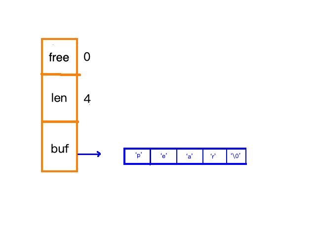

## Redis 有几种数据结构？Zset 是如何实现的？

* Redis的基本数据结构
  * string
  * hash
  * set
  * zet
  * list

* string
  * redis中的字符串是通过SDS来实现的。SDS的结构大致如图所示:  
    
  free代表了还剩多少空间；len代表了字符串长度；buf代表了具体存放的字符数组内容

  * 字符串的空间分配
    * 为了减少修改字符串导致的空间重新分配次数，redis采用了一次分配足够空间的方式
      * 如果修改后的字符串大小小于1MB的话，就多分配现有字符串长度的空间出来(比如现有字符串长度是3，那么就会再分配长度为3的空间出来)
      * 如果修改后的字符串大小大于1MB的话，除了扩充满足修改之后的长度之外，还会再多分配1MB的空间出来

* Zset是通过跳表来实现的。跳表保证了数据插入的有序性，并且通过随机抽取某个节点数据向上提升索引等级的方式，来使得查询的  
  效率得到提升。除此之外，跳表还支持了范围查询的特性。
